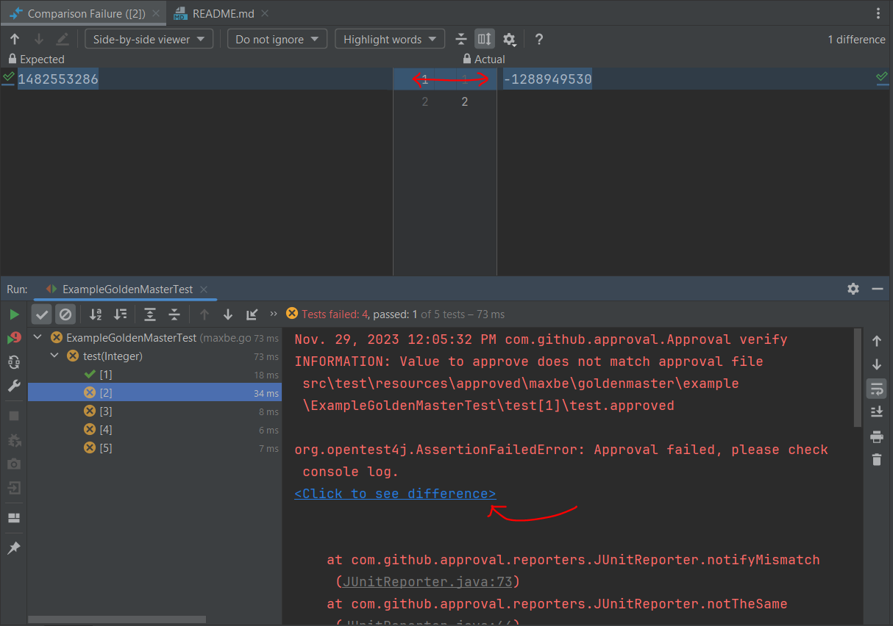

# goldenmaster-junit-extension
A harness for easy writing of [Golden Master tests](https://dzone.com/articles/testing-legacy-code-golden) in Java. This wraps **[FastApproval](https://github.com/maxbechtold/fast-approval)** in an easy to apply JUnit annotation. Follow the JitPack button below in order to include it in your project.

[](https://github.com/maxbechtold/golden-master/actions/workflows/maven.yml)
[](https://jitpack.io/#maxbechtold/golden-master)
## Benefits

* No cumbersome boilerplate code - focus on your program instrumentation
* Built-in repetitions - easily verify 10, 100, or 10,000 program inputs
* IDE integration - continuous visual feedback



## How to use (basic explanation)

You basically implement a [JUnit 5 templated test](http://junit.org/junit5/docs/current/user-guide/#writing-tests-test-templates) like so (check out [ExampleGoldenMasterTest](src/test/java/maxbe/goldenmaster/example/ExampleGoldenMasterTest.java) for more details & features):

```java
@GoldenMasterTest
public class ATest {

  @BeforeEach
  void setUp(File outputFile, Integer index) {
    // Setup up the inputs for your test run which must write output to the given file
  }
  
  @GoldenMasterRun
  void instrumentProgramUnderTest(Integer index) {
    // Do some hard work whose output will be compared to that of previous runs
  }
}
```

When you run your test for the first time, the outputs will serve as the initial *master files*. You are asked to *approve* the previous outputs by manually executing a generated script file.

Every successive test run will then be matched against those master files - and fail if there are changes (e.g. due to mistakes during refactoring of the tested code). Any mismatch between actual and expected output (the master files) is part of the thrown Exception - and will be visualized if you use an IDE that supports [OpenTest4J](https://github.com/ota4j-team/opentest4j) (e.g. Eclipse, IntelliJ)

If you change the tested code in a manner you consider *valid*, you can approve any changes that result in the output files by running the provided approval script.

## Requirements
Java 8

## Pitfalls
*Always* annotate test classes with `@GoldenMasterTest`, and use *only* `@GoldenMasterRun` for the test methods (cf. this [issue](https://github.com/maxbechtold/golden-master/issues/11))
